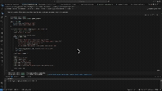
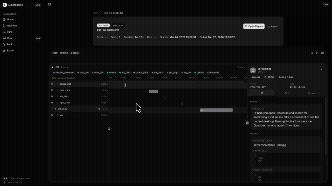

# Lunar Sandbox

Isolated Docker sandboxes for evaluating AI agents -- both **coding agents** (shell + file access) and **computer-using agents** (desktop GUI via VNC).

Every action is traced to a real-time dashboard with step replay, cost tracking, and batch analytics.





```
                  ┌─────────────────────────────────────┐
                  │         Your AI Agent Code           │
                  │  (OpenAI, Anthropic, LangChain, ...) │
                  └──────────────┬──────────────────────┘
                                 │
                  ┌──────────────▼──────────────────────┐
                  │          Session SDK                  │
                  │  agent_loop · tools · call_tool       │
                  └──────────────┬──────────────────────┘
                                 │
              ┌──────────────────┼──────────────────┐
              ▼                  ▼                   ▼
     ┌────────────────┐ ┌───────────────┐ ┌─────────────────┐
     │  Docker Sandbox │ │  CUA Sandbox  │ │ Trajectory Store│
     │  shell · files  │ │ VNC · desktop │ │ SQLite · JSONL  │
     └────────────────┘ └───────────────┘ └─────────────────┘
```

## Features

- **SDK with 4 lines of code** -- `Session` context manager handles sandbox lifecycle, tracing, and teardown
- **Provider-agnostic** -- built-in adapters for OpenAI and Anthropic; bring any LLM via the tool loop
- **Computer-Using Agents** -- full X11 desktop with Chromium, VNC streaming, screenshot capture, and mouse/keyboard injection
- **Real-time dashboard** -- WebSocket-powered live view of agent steps, screenshots, diffs, and cost
- **Batch evaluation** -- concurrent execution with retries, fail-fast, and JSONL streaming
- **Sandbox pooling** -- pre-warmed containers with fingerprint-based caching, LRU eviction, and health checks
- **Trajectory persistence** -- crash-safe JSONL writer + queryable SQLite store indexed by task, score, and timestamp
- **CLI** -- `lunar run`, `lunar eval`, `lunar replay`, `lunar pool` for terminal workflows
- **REST + WebSocket API** -- full HTTP API with OpenAPI spec and auto-generated TypeScript types
- **Cost tracking** -- built-in pricing for 15+ LLM models with per-task and per-batch cost reporting

## Prerequisites

- **Python 3.12+**
- **[uv](https://docs.astral.sh/uv/)** (Python package manager)
- **Docker** (required for sandbox containers)
- **Node.js 18+** and **[pnpm](https://pnpm.io/)** (for the dashboard)

## Quick Start

```bash
# Install dependencies and build the CUA Docker image
make setup

# Start the API server (port 8000) and dashboard (port 3000)
make dev
```

## SDK

The `Session` class is the main entry point. It creates an isolated Docker container, exposes tools for the agent, traces every action to the dashboard, and cleans up on exit.

### Agent loop with OpenAI

```python
from openai import OpenAI
from lunar_sandbox import Session, openai_adapter

client = OpenAI()  # uses OPENAI_API_KEY

with Session("fix-tests") as s:
    s.agent_loop(
        task="Fix the failing tests in main.py",
        call_llm=openai_adapter(client, model="gpt-4o"),
    )
```

### Agent loop with Anthropic

```python
from anthropic import Anthropic
from lunar_sandbox import Session, anthropic_adapter

client = Anthropic()

with Session("fix-tests") as s:
    s.agent_loop(
        task="Fix the failing tests",
        call_llm=anthropic_adapter(client, model="claude-sonnet-4-20250514"),
    )
```

### Agent loop with Mistral

Mistral's API is OpenAI-compatible, so `openai_adapter` works directly:

```python
import os
from openai import OpenAI
from lunar_sandbox import Session, openai_adapter

client = OpenAI(
    api_key=os.environ["MISTRAL_API_KEY"],
    base_url="https://api.mistral.ai/v1",
)

with Session("mistral-demo", image="python:3.12-slim") as s:
    s.agent_loop(
        task="Create a script that finds prime numbers up to 100, then write tests and run them",
        call_llm=openai_adapter(client, model="mistral-small-latest"),
    )
```

See [`examples/mistral_agent.ipynb`](examples/mistral_agent.ipynb) for a full runnable notebook.

### Custom tool loop (any provider)

```python
import json
from openai import OpenAI
from lunar_sandbox import Session

client = OpenAI()

with Session("my-task") as s:
    tools = s.tools(format="openai")  # or "anthropic" or "raw"
    messages = [{"role": "user", "content": "Create hello.py and run it"}]

    for _ in range(10):
        resp = client.chat.completions.create(
            model="gpt-4o", messages=messages, tools=tools,
        )
        msg = resp.choices[0].message
        messages.append(msg)

        if not msg.tool_calls:
            break

        for tc in msg.tool_calls:
            result = s.call_tool(tc.function.name, json.loads(tc.function.arguments))
            messages.append({"role": "tool", "tool_call_id": tc.id, "content": result})

    s.finish(score=1.0)
```

### Direct sandbox access (no LLM)

```python
from lunar_sandbox import Session

with Session("setup-env", image="python:3.12-slim") as s:
    s.run("pip install -q numpy pandas")
    s.write_file("data.csv", csv_content)
    output = s.run("python analyze.py")
    s.finish(score=1.0)
```

### Session API reference

| Method | Description |
|--------|-------------|
| `Session(task_name, image=...)` | Create a session with an isolated Docker container |
| `s.agent_loop(task, call_llm, max_steps=30)` | Run a full agent loop with automatic tool dispatch |
| `s.tools(format="openai"\|"anthropic"\|"raw")` | Get tool definitions for your LLM provider |
| `s.call_tool(name, args)` | Execute a tool and record the step |
| `s.run(command)` | Execute a shell command in the sandbox |
| `s.read_file(path)` | Read a file from `/workspace` |
| `s.write_file(path, content)` | Write a file to `/workspace` |
| `s.list_files(path=".")` | List files in a directory |
| `s.finish(outcome=..., score=...)` | End the session with a result |

## Computer-Using Agents (CUA)

CUA mode provides a full desktop environment inside Docker -- Xvfb display, Openbox window manager, Chromium browser, VNC server -- with screenshot capture and mouse/keyboard injection for evaluating GUI agents.

### Launch via API

```bash
curl -X POST http://localhost:8000/api/cua/episodes \
  -H "Content-Type: application/json" \
  -d '{
    "instruction": "Go to example.com and find the contact page",
    "start_url": "https://example.com",
    "agent_mode": "manual",
    "reward": {"type": "manual"}
  }'
```

### Launch via dashboard

Navigate to `http://localhost:3000` and use the CUA Launcher. The live view streams the desktop via VNC with a real-time activity panel showing each agent step.

### CUA task configuration

| Field | Default | Description |
|-------|---------|-------------|
| `instruction` | *(required)* | Natural-language task for the agent |
| `start_url` | `null` | Opens Chromium at this URL; `null` = clean desktop |
| `reward.type` | `"manual"` | `"manual"`, `"script"`, or `"screenshot_match"` |
| `max_steps` | `1000` | Max agent steps before termination |
| `time_limit` | `300` | Max wall-clock seconds |
| `resolution` | `"1280x800"` | Display resolution |
| `screenshot_format` | `"jpg"` | `"jpg"` or `"png"` (use png for pixel-exact comparison) |

### Reward types

- **Manual** -- human reviewer assigns a score via the dashboard
- **Script** -- runs a validation script inside the container; exit 0 = success
- **Screenshot match** -- SSIM comparison against a reference image with configurable threshold and crop region

## CLI

```bash
# Run a single task
lunar run task.yaml --agent my_agent:Agent -v

# Batch evaluation
lunar eval benchmark.yaml --agent my_agent:Agent --workers 4 --pass-threshold 0.8

# Replay a saved episode
lunar replay ep-abc123

# Manage the sandbox pool daemon
lunar pool start
lunar pool status
lunar pool stop

# View performance telemetry
lunar telemetry
```

### Task definition (YAML)

```yaml
name: fix-tests
repo: https://github.com/user/project  # or a local path
instructions: "Fix the failing tests"
test_command: "pytest tests/"
setup_commands:
  - "pip install -e ."
timeout: 1800
max_steps: 200
runtime: python3.12
deps:
  - pytest
  - numpy
env:
  DEBUG: "1"
```

## REST API

All endpoints are prefixed with `/api`. The OpenAPI spec is auto-generated from Pydantic schemas.

### Episodes

```
GET    /api/episodes                              # List episodes (paginated, filterable)
GET    /api/episodes/{episode_id}                 # Episode detail with steps
```

### CUA

```
POST   /api/cua/episodes                          # Launch CUA episode
GET    /api/cua/episodes                          # List CUA episodes
GET    /api/cua/episodes/{episode_id}             # CUA episode detail
GET    /api/cua/episodes/{id}/screenshots/{file}  # Download screenshot
PATCH  /api/cua/episodes/{episode_id}/score       # Set manual review score
```

### Runs & Batches

```
POST   /api/runs                                  # Launch a run
GET    /api/batches                               # List batch runs
GET    /api/batches/{batch_id}                    # Batch detail with results
```

### Tasks

```
GET    /api/tasks                                 # List registered tasks
POST   /api/tasks                                 # Register a task
GET    /api/tasks/{task_name}                     # Get task definition
DELETE /api/tasks/{task_name}                     # Delete task
```

### Sandbox Pool

```
GET    /api/sandboxes                             # Pool status
GET    /api/sandboxes/{sandbox_id}                # Sandbox detail
GET    /api/pool/health                           # Pool health metrics
```

### WebSocket

```
WS     /api/ws                                    # Multiplexed event stream (topics: cua:{id}, pool:status)
WS     /api/cua/vnc/{episode_id}                  # VNC proxy (binary RFB frames)
WS     /api/sandboxes/{sandbox_id}/shell          # Interactive shell
```

### Code generation

TypeScript types are generated from the OpenAPI spec:

```bash
make codegen  # exports openapi.json -> web/packages/types/src/api.d.ts
```

## Configuration

### Engine config

| Setting | Default | Description |
|---------|---------|-------------|
| `max_workers` | `0` (auto) | Max parallel task executions |
| `pool_size` | `0` (auto) | Max sandboxes in pool (`workers * 2`) |
| `sandbox_backend` | `"auto"` | `"docker"`, `"native"` (Linux kernel), or `"auto"` |
| `docker_image` | `"python:3.12-slim"` | Default image for coding sandboxes |
| `task_timeout` | `1800` | Per-task timeout in seconds |
| `max_retries` | `1` | Retries for infrastructure errors |
| `fail_fast` | `false` | Stop batch on first failure |

### Environment variables

| Variable | Description |
|----------|-------------|
| `OPENAI_API_KEY` | OpenAI API key (for OpenAI agent examples) |
| `ANTHROPIC_API_KEY` | Anthropic API key (for Claude CUA agent) |

## Project Structure

```
├── src/lunar_sandbox/
│   ├── api/                    # FastAPI app, routers, WebSocket hub, schemas
│   ├── cli/                    # Typer CLI (run, eval, replay, pool, telemetry)
│   ├── sdk/                    # Session API, engine, adapters, convenience wrappers
│   ├── cua/                    # CUA runner, task schema, reward evaluator, model agent
│   ├── sandbox/                # Docker/CUA sandbox lifecycle, config, health checks
│   ├── actions/                # Action client/executor, CUA input handler, protocol
│   ├── pool/                   # Sandbox pool, evictor, metrics, memory pressure
│   ├── scheduler/              # Batch scheduler, result store, retry logic
│   ├── trajectory/             # JSONL writer, SQLite store, trajectory models
│   ├── episode/                # Episode runner, scoring, state tracking
│   ├── task/                   # YAML task loader, repo checkout, fingerprinting
│   ├── kernel/                 # Linux namespaces, OverlayFS, cgroups, seccomp
│   ├── filesystem/             # Environment fingerprinting, layer management
│   ├── telemetry/              # Metrics collector, percentile computation, storage
│   └── docker/cua/             # CUA Dockerfile (Ubuntu + Xvfb + Openbox + VNC)
├── tests/
│   ├── unit/                   # Unit tests (CUA, trajectory)
│   └── test_*.py               # Integration + API tests
├── web/
│   ├── apps/dashboard/         # React 19 + Vite + Tailwind + shadcn/ui
│   └── packages/types/         # Auto-generated TypeScript types from OpenAPI
├── examples/                   # Agent examples (OpenAI, LangChain)
├── scripts/                    # Build and codegen scripts
├── Makefile                    # Project commands
└── pyproject.toml              # Python project config (uv)
```

## Development

### Running dev servers

```bash
# Both FastAPI (port 8000) and Vite dashboard (port 3000)
make dev

# Backend only
uv run uvicorn lunar_sandbox.api.app:app --reload --host 0.0.0.0 --port 8000

# Frontend only
cd web && pnpm --filter dashboard dev
```

### Testing

```bash
make test                                    # all Python tests
uv run pytest tests/test_health.py -v        # specific test file
uv run pytest --cov                          # with coverage
```

### Linting & type checking

```bash
make lint                                    # frontend ESLint
cd web/apps/dashboard && npx tsc --noEmit    # TypeScript type check
```

### Building

```bash
make docker-cua       # Build CUA Docker image (lunar-cua:latest)
cd web && pnpm build  # Frontend production build
make clean            # Remove build artifacts
```

## Tech Stack

| Layer | Stack |
|-------|-------|
| Backend | Python 3.12, FastAPI, Pydantic, uvicorn, structlog |
| Frontend | React 19, Vite 6, TypeScript, Tailwind CSS 4, shadcn/ui |
| Isolation | Docker, Linux namespaces, OverlayFS, cgroups v2, seccomp-bpf |
| Persistence | SQLite (WAL mode), JSONL |
| Real-time | WebSocket (multiplexed hub with pub/sub topics) |
| Desktop | Xvfb, Openbox, x11vnc, websockify, noVNC |
| Testing | pytest, ESLint |
| Tooling | uv, pnpm, Docker |

## License

MIT
